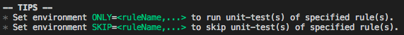

#	hiting
__Highlight-text printer for console.__

>	If links in this document not avaiable, please access [README on GitHub](./README.md) directly.

##  Description

This tool will automatically parse plain text and print colorful and easy-to-read text in console. Users are allowed to supply a favorite printing style. However, that is all!

##	Table of Contents

* [Links](#links)
* [Get Started](#get-started)
* [API](#api)

##	Links

*	[CHANGE LOG](./CHANGELOG.md)
*	[Homepage](https://github.com/YounGoat/nodejs.hiting)

##	Get Started

CLI mode:
```bash
# Globally install.
npm install -g hiting
hiting <path-of-txt-file>
```

API mode:
```javascript
const hiting = require('hiting');

// Parse and print plain text in "tips" style.
hiting(text, 'tips');
```

##	API

*   __hiting__(string|Buffer *text*, string *style*)  
    See section [Styles](#styles) for available values of parameter *style*.
    
##  Styles

In current version, only one style is avaiable. More styles will be supplied in later versions. The realization of existing styles may be changed in subsequent versions. So, DO NOT REARRANGE THE OUTPUT OF __hiting__. Just read it.

Following colorful texts in black background are generated by __hiting__.

*   __tips__  
      
    *Generated by version 0.0.1*